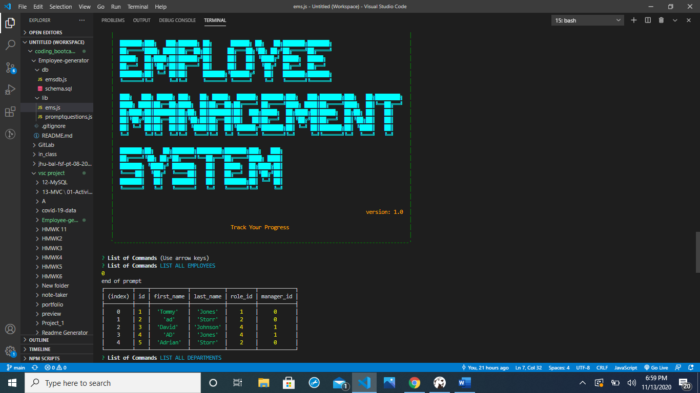

# Employee-generator

[link to Github page](https://github.com/AdrianStorr/Employee-generator)

## Table of Contents
  * [Description](Description)
  * [Usage](Usage)
  * [Installation](Installation)
  * [License](License)
  * [Contributors](contributers)
  * [Test](Test)
  * [Questions](Questions)

[Link to video demonstration](https://drive.google.com/file/d/1e93bwgnMhm7jqi-4lN2EWITR14xr717C/view?usp=sharing)
  ## Description
    To architect and build a solution for managing a company's employees using node, inquirer, and MySQL. 

  ## Installation Instuctions
 Build a command-line application that at a minimum allows the user to:

  *Add departments, roles, employees

  *View departments, roles, employees

  *Update employee roles
  

  ## Usage Information
 Run npm install,node ems.js in terminal with addition of mysql package to connect my database and form queries and inquirer.js package to interact with the user using the command-line.

  ## License
  None

  ## Contributers
  one

  ## Test
  testing

  ## Question
  Contact me:

  Github:[AdrianStorr](https://github.com/AdrianStorr)
  
  Email :[Adggmail.com](https://github.com/AdrianStorr)
